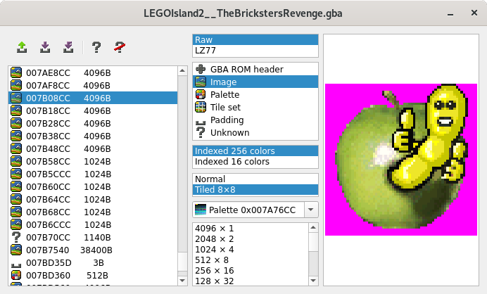

UI application to dissect a Game Boy Advance ROM.

The idea of the tool is not to grab the content directly, but to identify
the location of the content in the ROM memory and the way to interpret it.

In the end the whole ROM memory can be segmented, saved in human readable
file (`.toml`), and could be used in different ways.

That's tuff process.



# Features

- Image
   - Indexed 16 or 256 colors
   - 8x8 tiled memory layout
- Palette in RGB 16 bits
- Data compressed in LZ77
- Hexa, pixel, audio sample browser for unidentified memory
- Viewer for image, palette, tile set, sample, few music table, GBA header

# Install

```
pip install git+https://github.com/vallsv/romsection
```

# Launch

```
python -m romsection
```

# Useful resources

The following resources provide a very useful information on different
aspects of the GBA.

- [GBATEK](https://problemkaputt.de/gbatek.htm)
- [CowBite Virtual Hardware Specifications](https://www.cs.rit.edu/~tjh8300/CowBite/CowBiteSpec.htm)
- [GBA LZ77 codec in cpp](https://github.com/lunasorcery/gba-lz77)
- [Nintenlord Hacking](https://github.com/TimoVesalainen/Nintenlord.Hacking)
- [Decoding the ARM7TDMI instruction set](https://www.gregorygaines.com/blog/decoding-the-arm7tdmi-instruction-set-game-boy-advance/)
- [GBAC BinarySerializer.Nintendo](https://github.com/BinarySerializer/BinarySerializer.Nintendo)
